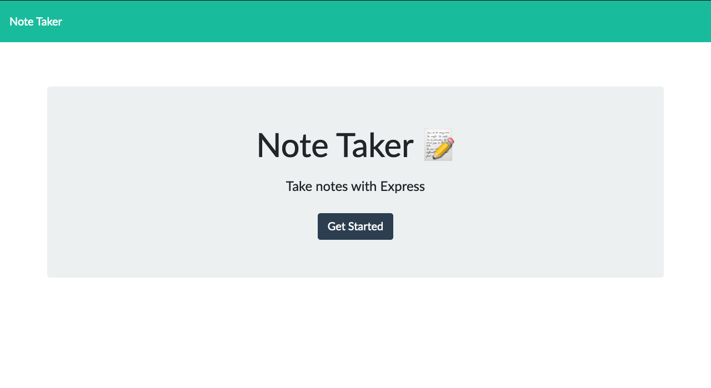
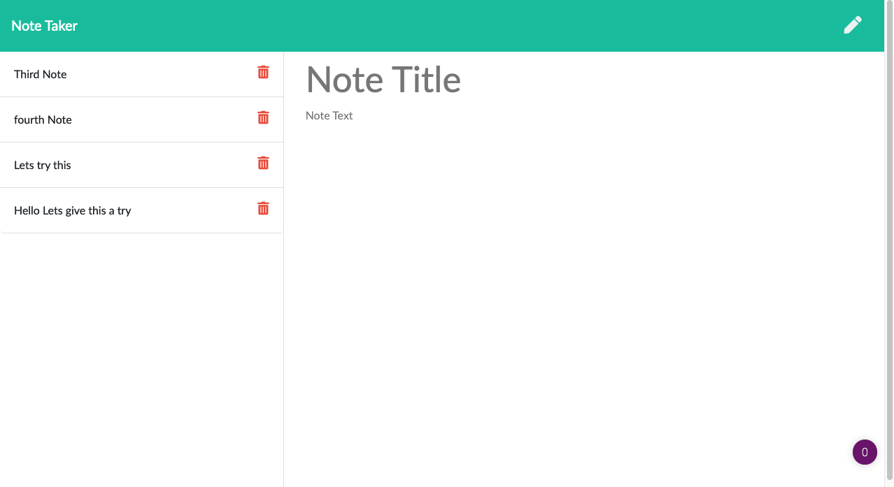

# Note Taker

## Description
This is a simple note taking app that lets you write down and save your ideas. 

## Built With
 - Node.js
 - Express.js
 - Javascript
 - HTML
 - CSS

### Dependencies
 - Express.js
 - Node.js
  
## Installation
Clone this repo and then in your terminal run `code` npm i `code` and then navigate to your local host to view this application

## Visuals

## Deployed Application

[Application](https://tranquil-sierra-97362.herokuapp.com/)

